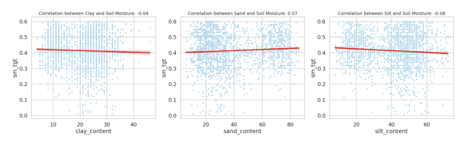
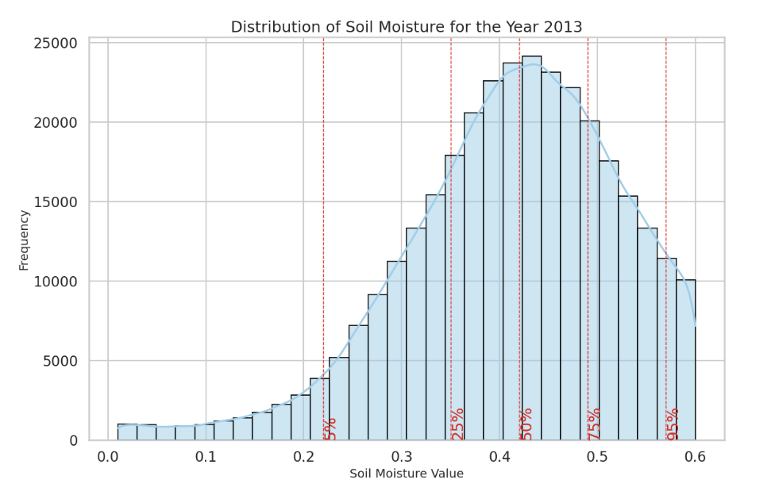
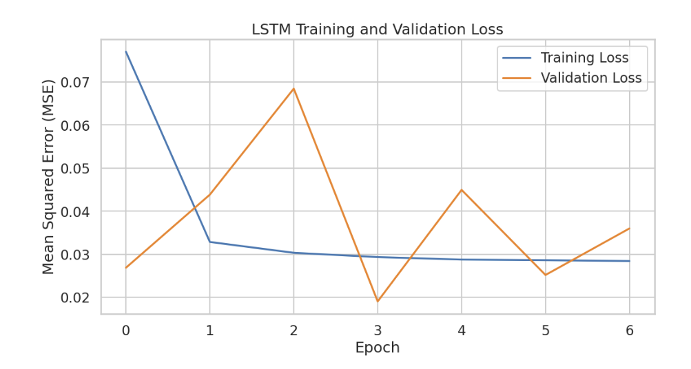
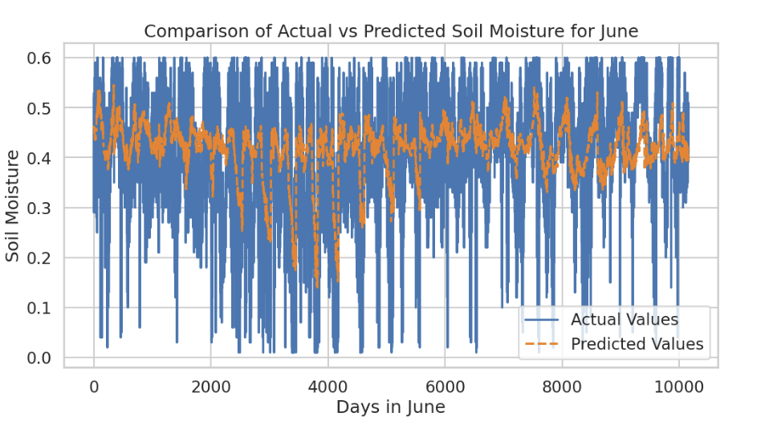

# README


```python
from IPython.display import display, HTML
import markdown
from IPython.display import Image

# Custom CSS
custom_css = """
<style>

    h1{
        font-family: 'Georgia';
        color: #34495e;
        border-bottom: 5px solid #3498db;
        padding-bottom: 10px;
        
    }

    h2{
        font-family: 'Georgia';
        color: #34495e;
        border-bottom: 3px solid #3498db;
        padding-bottom: 10px;
        
    }
        
    p {
        font-family: 'Arial';
        font-size: 16px;
        color: #2c3e50;
        margin-top: 20px;
        
    }
    
    ul{
    
        color: #34495e;
        font-size: 16px;
    
    }
    
</style>
"""
display(HTML(custom_css))
```


<style>

    h1{
        font-family: 'Georgia';
        color: #34495e;
        border-bottom: 5px solid #3498db;
        padding-bottom: 10px;

    }

    h2{
        font-family: 'Georgia';
        color: #34495e;
        border-bottom: 3px solid #3498db;
        padding-bottom: 10px;

    }

    p {
        font-family: 'Arial';
        font-size: 16px;
        color: #2c3e50;
        margin-top: 20px;

    }

    ul{

        color: #34495e;
        font-size: 16px;

    }

</style>


## Da dove nasce l'idea
Il progetto era nato durante il contamination lab riguardante un <a href="https://www.contaminationlab.it/">Laboratorio di Ingegneria Agroforestale</a> promosso dall'università di udine.

Una volta divisi in 4 gruppi abbiamo scelto un progetto a piacere dei 4 proposti. Il progetto del nostro gruppo prevedeva la creazione di nuovi metodi per determinare l'umidità del terreno delle culture (tipicamente vigne) con metodi molto restrittivi, arrivammo secondi nel concorso.

In poco tempo il progetto venne realizzato e <a href="https://uniudamce-my.sharepoint.com/:v:/g/personal/173000_spes_uniud_it/EaKVPIZ7o0ZBgGZqVkbBr3EB2KAxS60Xpb3q8_QZw4wytA?nav=eyJyZWZlcnJhbEluZm8iOnsicmVmZXJyYWxBcHAiOiJPbmVEcml2ZUZvckJ1c2luZXNzIiwicmVmZXJyYWxBcHBQbGF0Zm9ybSI6IldlYiIsInJlZmVycmFsTW9kZSI6InZpZXciLCJyZWZlcnJhbFZpZXciOiJNeUZpbGVzTGlua0NvcHkifX0&e=mnYkTu">l'idea</a>, riassunta in breve, prevedeva di mappare il terreno, e con una serie di dati creare un modello LSTM per prevedere l'umidità del suolo senza la necessita di rilevazioni capillari.

Per mancaza di tempo il progetto originale non aveva delle correlazioni evidenti, quindi generare un moello AI non è stato possibile. Generare un modello LSTM preciso è ancora un obbiettivo distante, tuttavia questo progetto ha gettato delle basi ideali per questo corso universitario.

il progetto iniziale si ispirò a una <a href="https://www.kaggle.com/code/sathyanarayanrao89/lstm-for-soil-moisture-prediction">pubblicazione kaggle</a>. Anche questo elaborato ha alcuni elementi stilistici comuni.

A seguito alcuni estratti del primo progetto:


```python
display(Image(filename='per_presentazione/vecchio_progetto/correlazione.png'))
display(Image(filename='per_presentazione/vecchio_progetto/distribuzione.png'))
display(Image(filename='per_presentazione/vecchio_progetto/fasi.png'))
display(Image(filename='per_presentazione/vecchio_progetto/precisione.png'))
```


    

    


    

    


    

    


    

    


## Differenze dal primo dataset
- L'originale aveva precisione satellitare di circa 16Km, una sola misurazione al giorno
- Il nuovo dataset continene sia rilevazioni mattutine, che pomeridiane. La precisione è ora di 9Km.
<br>

- Il vecchio dataset conteneva solo la tessitura del suolo, sempre con una precisione di 16Km.
- Il nuovo dataset continene descrizioni dettagliate per ogni tipo di terreno - circa 2500 - contenendo numerevoli dati delle proprietà fisiche e chimiche, la  precisione ora è di circa 100m.
<br>

- Disponiamo ora di oltre 500 stazioni meteo all'interno della germania per determinare fattori atmosferici con precisione giornaliera.

## Files da scaricare
Tutti i dataset si scaricano in maniera autonoma (o sono già presenti se leggeri) eseguendo il codie, le uniche due eccezioni sono i files della nasa (per scaricarli sono presenti istruzioni all'interno del programma stesso - sconsiglio di scaricare: pesano oltre 200GB) e <a href="https://geoportal.bgr.de/mapapps/resources/apps/geoportal/index.html?lang=de#/datasets/portal/d443a2ac-8eb5-49f7-ad80-bdfa05a96b47">buek250_mgm_utm_v60.gpkg</a>, va scaricato il file GeoPackage e tutti gli elementi vanno estratti in `"datasets/TESSITURA/"`


## Esecuzione del codice
Una volta soddisfatte le richieste dei files da scaricare manualmente, il codice è pensato per scaricare in maniera autonoma tutti i dataset, estrarli, analizzarli, generare i grafici e salvarli.

La completa esecuzione del codice piò richiedere diverse ore, i passaggi più lunghi da processare sono indicati nelle caselle di Markdown prima del pezzo di script interessato.

## Ulteriori note
Il codice è commentato ad ogni passaggio con del testo Mardown e all'inteno del codice stesso dovrebbero essere presenti sufficenti commenti per rendere la lettura scorrevole.

Il progetto da visionare per l'esame si chiama `analisi_umidità_terreno.ipynb`, il file `introduzione_a_h5pyfiles.ipynb` è una rapida spiegazione di come analizzare i file formato h5. Ho deciso di realizzarla perchè ho trovato il processo particoarlemente interessante e degno di nota.
